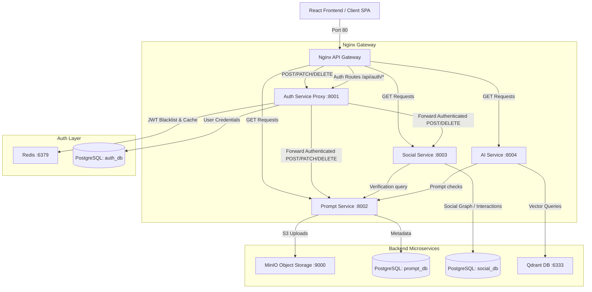

# Promptgram: Technical Architecture & System Documentation

Promptgram is a modern, high-performance, microservice-based AI prompt sharing and discovery platform. The application provides interactive social features (likes, comments, following, and collections) alongside visual/semantic search powered by CLIP multi-modal image embeddings and a vector database.

This document describes the architectural layout, core microservices, system data flow, port configurations, and file structure of Promptgram.

---

## 1. System Architecture & Routing Flow

Promptgram uses a **decentralized microservices model** paired with a **centralized API gateway (Nginx)** and a **centralized auth proxying layer** for all authenticated state-modifying requests.

Below is a technical layout of how client requests route through the gateway, and how write operations (POST, PATCH, DELETE) are intercepted and proxied through `auth-service` to validate credentials, while read operations (GET) are direct to maximize speed.

### Architecture Topology Diagram


---

## 2. Docker Container & Services Breakdown

Promptgram's containerized infrastructure runs via `docker-compose.yaml` in a bridge network (`promptgram_net`).

| Container Name | Compose Service | Port (Host:Container) | Core Technology | Primary Responsibility / Dependencies |
| :--- | :--- | :--- | :--- | :--- |
| **`promptgram_gateway`** | `nginx` | `80:80` | `nginx:1.25-alpine` | API Gateway & static asset server. Integrates HTTP maps to direct traffic conditionally. Depends on frontend build success and all healthy backend services. |
| **`promptgram_auth`** | `auth-service` | `8001:8001` | Python (FastAPI) | Handles login, token generation, user accounts, JWT blacklist caching in Redis, and serves as the **centralized authentication proxy** for state-modifying endpoints. Connects to `postgres` (`auth_db`) and `redis`. |
| **`promptgram_prompt`** | `prompt-service` | `8002:8002` | Python (FastAPI) | Manages prompt creation, editing, deletion, search, and image metadata. Communicates with `postgres` (`prompt_db`), `redis`, and uploads images directly to `minio`. |
| **`promptgram_social`** | `social-service` | `8003:8003` | Python (FastAPI) | Manages social graphs including likes, comments, user follows, and customized user collections. Connects to `postgres` (`social_db`) and communicates downstream with `prompt-service` to verify resource targets. |
| **`promptgram_ai`** | `ai-service` | `8004:8004` | Python (FastAPI) | Serves visual-semantic features. Generates multi-modal embeddings using a CLIP model (ML weights loaded on startup) and stores/queries high-dimensional vectors. Connects to `qdrant` and depends on `prompt-service`. |
| **`promptgram_postgres`**| `postgres` | `5432:5432` | `postgres:16` | Persistent shared SQL storage. Automatically initializes three separated schemas (`auth_db`, `prompt_db`, `social_db`) on first start using initialization scripts. |
| **`promptgram_redis`** | `redis` | `6379:6379` | `redis:7-alpine` | Shared cache and message broker. Used primarily by the `auth-service` to check JWT blacklists (handling session invalidation/logout) and other services for lightweight caching. |
| **`promptgram_qdrant`** | `qdrant` | `6333:6333`<br>`6334:6334` | `qdrant/qdrant:v1.9.0` | Vector Database for image semantic indexing. Port `6333` hosts the REST/gRPC API used by the AI Service, and Port `6334` mounts the Qdrant Web Dashboard UI. |
| **`promptgram_minio`** | `minio` | `9000:9000`<br>`9001:9001` | `minio/minio` | S3-Compatible Object Storage. Holds high-resolution uploaded prompt images. Port `9000` is the API endpoint used by the prompt service, and Port `9001` is the local web console. |
| **`promptgram_frontend`**| `frontend` | *Internal only* | React, Vite, CSS | Single-page application (React). Built in its own container context, exporting ready production assets (`/dist`) to a shared Docker volume `frontend_dist` which is served by the Nginx API gateway. |

---

## 3. How It Works: Centralized Authentication & Proxying

The key highlight of this architecture is **Centralized Authentication Proxying**. It provides strong authorization boundaries without requiring individual microservices to manage database tables or perform duplicate user queries.

### The Request Lifecycle (Mutating Actions)

1. **Routing in Gateway (Nginx)**:
   - To avoid request body loss (a common bug when utilizing `if ($request_method = POST)` nested inside `location` blocks), Nginx uses conditional **`map` blocks** defined at the HTTP context level.
   - For example, when a client hits `/api/prompts/` with a `POST` request, Nginx references `$prompt_upstream`. If the request method is `POST`, `PATCH`, or `DELETE`, the map switches the target upstream to `http://auth_service`. If it's a `GET` request, it resolves to `http://prompt_service`.

2. **Decoupled Verification in Auth Service**:
   - The request lands on the specialized proxy routers (`prompt_auth.py`, `images_auth.py`, `social_auth.py`) inside `services/auth/routers/`.
   - The router invokes FastAPI's `Depends(get_current_user)` which extracts the JWT Bearer token, queries the Redis blacklist, and decodes the payload against the local Postgres database (`auth_db`).
   - If authorization succeeds, it builds a proxy request to the target downstream microservice.

3. **Downstream Execution**:
   - The `auth-service` makes an asynchronous HTTP client request (`httpx.AsyncClient`) to the downstream microservice (e.g. `http://prompt-service:8002/prompts/`), passing the incoming headers, parsed body, and query parameters.
   - The downstream service receives the fully authenticated request payload. Once finished, it replies to `auth-service`, which in turn passes the response transparently back to the Nginx gateway and onto the client.

### Special Handling: File & Form Multipart Payload (Prompt Creation)
For complex operations like prompt creation where the user can submit both textual data and a high-resolution binary image at the same time:
- The `auth-service` parses the incoming multi-part form parameters (`title`, `prompt_data`, and the `image` UploadFile).
- It extracts the `prompt_data` (JSON string) and injects the extracted `title`. It makes a JSON POST request to the downstream `prompt-service` to write the prompt metadata first.
- Upon receiving a successful response and the newly generated database ID, the `auth-service` reads the image binary file payload and forwards it directly to the prompt-service's upload endpoint, linking the file with the generated prompt ID.

---

## 4. Database Schema & Data Models

The system relies on Postgres, utilizing UUIDs as primary keys across all tables. Microservices enforce strict boundary separation by avoiding cross-database Foreign Key constraints.

- **Auth Database (`auth_db`)**:
  - `User`: Primary account record. Columns include `id` (UUID), `username`, `email`, `password_hash`, `avatar_url`, `bio`, and `created_at`.
  
- **Prompt Database (`prompt_db`)**:
  - `Prompt`: Represents an uploaded AI prompt. Columns include `id` (UUID), `user_id` (UUID, *cross-service reference*), `title`, `prompt_text`, `tags` (Array), `model_used`, `score`, `views`, and `downloads`.

- **Social Database (`social_db`)**:
  - `Like`: Maps `user_id` to `prompt_id` with a strict unique constraint.
  - `Comment`: Contains `user_id`, `prompt_id`, and the text `body`.
  - `Follow`: Bi-directional relation mapping `follower_id` to `following_id`.
  - `Collection` & `CollectionPrompt`: Allows users to aggregate and group prompts together privately or publicly.

*Microservice Design Note: Because there are no Foreign Key constraints crossing the service boundaries, the Social Service relies on API calls (via internal DNS) to the Prompt Service when it needs to verify if a `prompt_id` actually exists before a user can comment on it.*

---

## 5. AI & Machine Learning Pipeline

The AI Service leverages the `open_clip` library and PyTorch models, fully initialized into the FastAPI application state during server start (lifespan hooks).

1. **Semantic & Visual Embeddings**: Uses `open_clip` with the `ViT-B-32` architecture (OpenAI pretrained weights). This generates unified high-dimensional vector embeddings for both textual prompts and image uploads, which are piped directly into **Qdrant** for lightning-fast cosine-similarity vector searches.
2. **Image Classification**: Employs `MobileNet_V3_Large` loaded with ImageNet weights. This model processes images using PyTorch `torchvision.transforms` to output labels and categorical tags automatically.
3. **NSFW Moderation**: Integrates `NudeDetector` (an ONNX-backed model) to scan visual assets for explicit material asynchronously, ensuring safe public feeds.

---

## 6. Frontend Technical Stack

The frontend is built as a highly responsive, high-performance Single Page Application (SPA).

- **Core & Build**: React 18 powered by **Vite**, optimizing HMR during development and outputting highly minified production bundles.
- **Routing**: `react-router-dom` v6 for client-side navigation.
- **Styling**: Premium custom CSS architecture (`index.css`) relying heavily on modern CSS variables, flexbox/grid layouts, dynamic dark modes, and micro-animations to achieve a state-of-the-art aesthetic.
- **Animations**: `framer-motion` handles physics-based, butter-smooth layout transitions and component mount sequences.
- **Iconography**: `lucide-react` for crisp, consistent vector icons.
- **Networking**: `axios` handles all HTTP client requests, seamlessly passing JWT tokens to the Nginx gateway (`/api/*`).

---

## 7. File Structure Directory Tree

Below is the directory structure layout, showing the organization of the codebase:

```bash
centralize-auth-endpoints-service/
├── docker-compose.yaml               # Orchestrates the 10 multi-container services
├── nginx/
│   └── nginx.conf                    # API gateway setup, map-based proxying rules
├── scripts/
│   └── init-dbs.sql                  # Auto-creates databases (auth_db, prompt_db, social_db)
├── frontend/                         # React SPA (Vite + CSS)
│   ├── Dockerfile                    # Builds the static frontend React bundle
│   ├── vite.config.js                # Vite build/bundling rules
│   ├── package.json                  # Frontend dependencies (framer-motion, axios, etc.)
│   └── src/
│       ├── index.css                 # Premium custom design system and layout styling
│       ├── App.jsx                   # Central layout and route map
│       └── ...
└── services/                         # Python Backend Microservices (FastAPI)
    ├── auth/                         # --- AUTHENTICATION SERVICE ---
    │   ├── database.py               # SQLAlchemy db engine for auth_db
    │   ├── models/                   # User schema
    │   └── routers/                  # API routes (auth and central authentication proxies)
    │       ├── prompt_auth.py        # Central proxy for prompt modifications
    │       ├── images_auth.py        # Central proxy for visual assets uploading/deletions
    │       └── social_auth.py        # Central proxy for commenting, liking, following
    │
    ├── prompt/                       # --- PROMPT SERVICE ---
    │   ├── database.py               # SQLAlchemy db engine for prompt_db
    │   ├── s3_client.py              # AWS S3 / MinIO storage management SDK
    │   └── models/                   # Prompt and Image schema
    │
    ├── social/                       # --- SOCIAL SERVICE ---
    │   ├── database.py               # SQLAlchemy db engine for social_db
    │   └── models/                   # Likes, Comments, Follows, Collections schemas
    │
    └── ai/                           # --- AI EMBEDDING & SEARCH SERVICE ---
        ├── model_manager.py          # PyTorch models initialization (CLIP, MobileNet)
        └── qdrant_client_helper.py   # Indexes and queries vectors inside Qdrant
```
